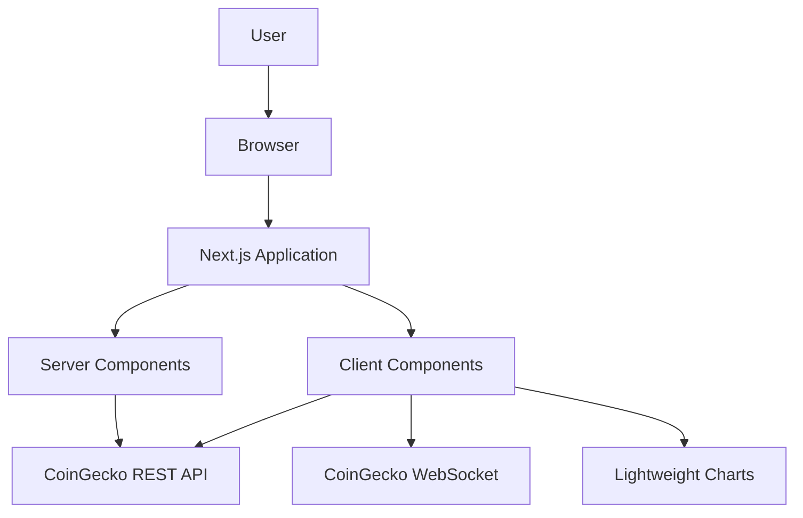
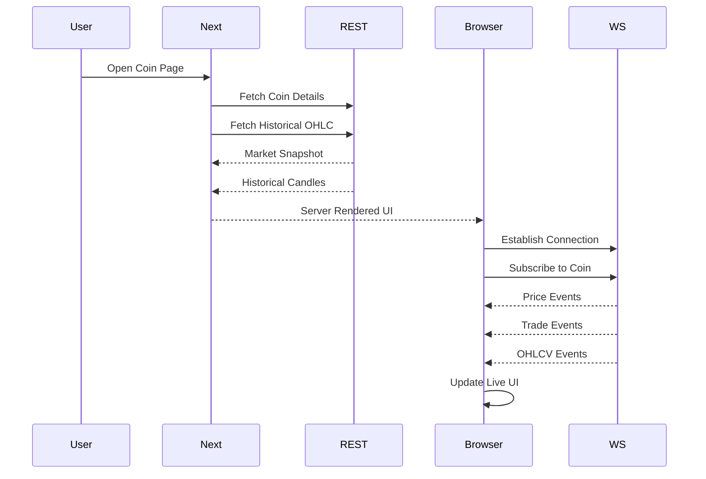
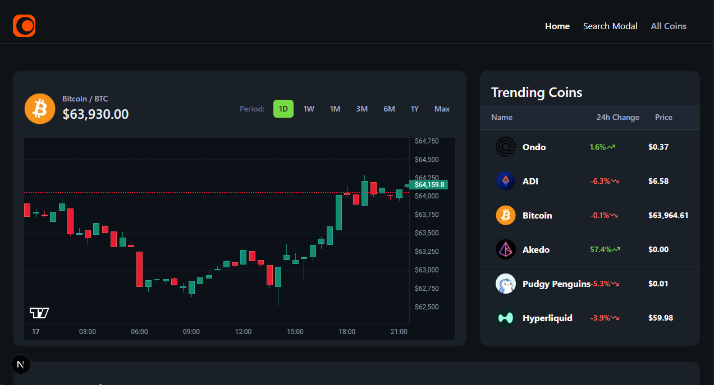
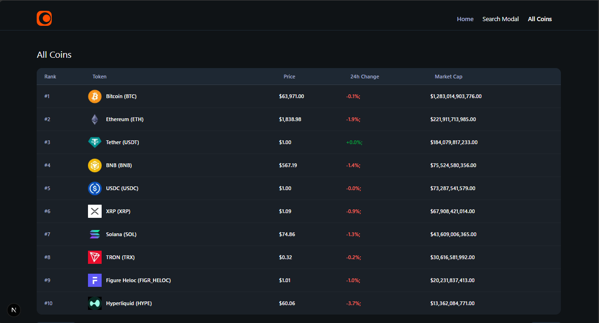
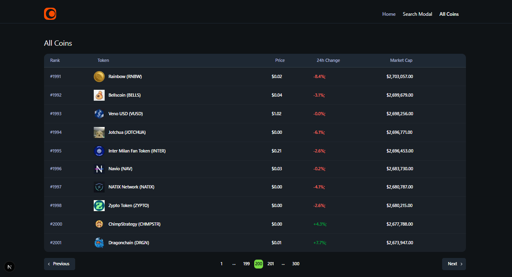
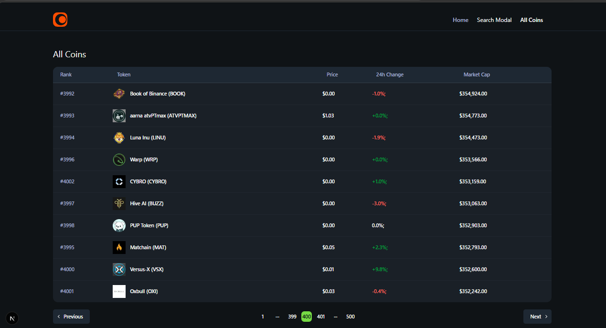
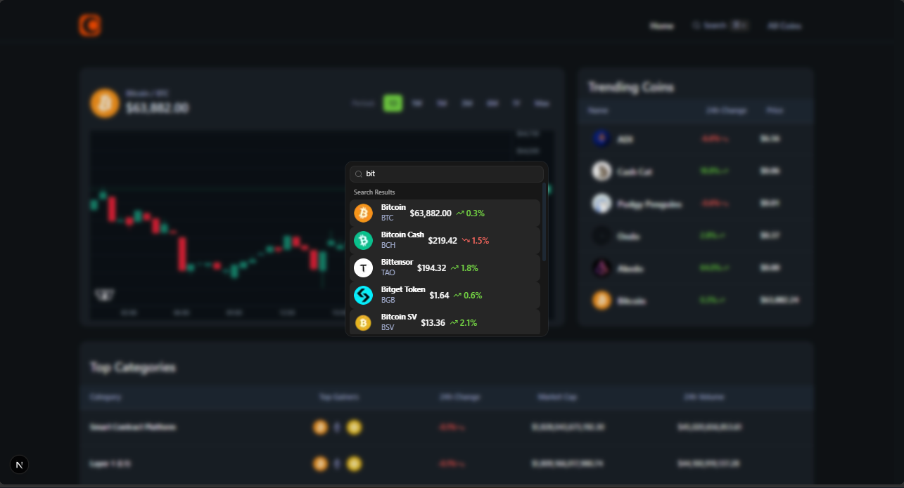
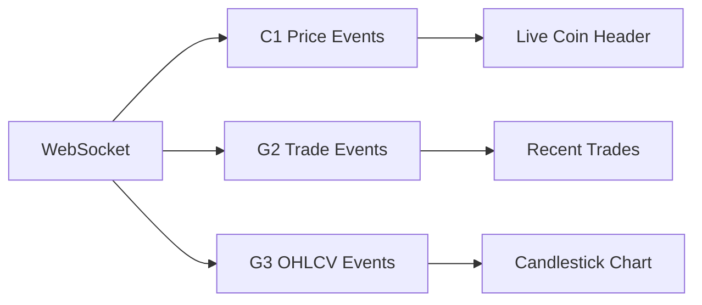
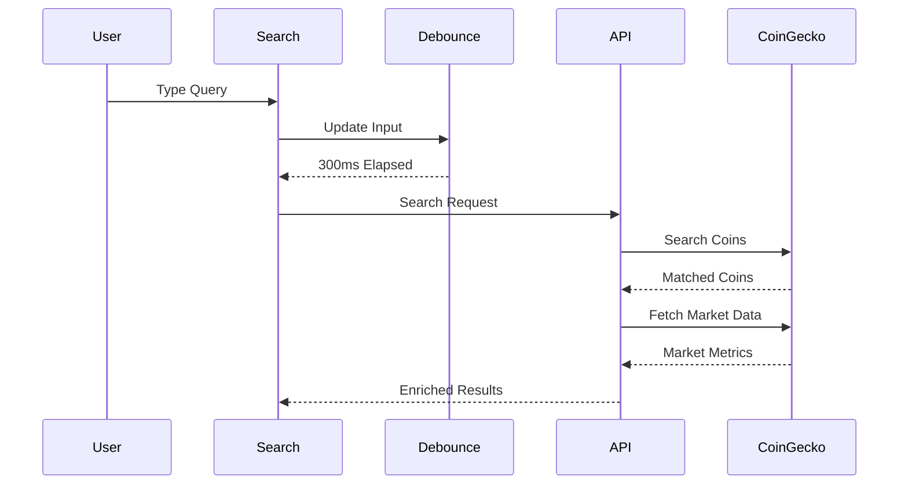

# Dexpto Terminal

> A real-time cryptocurrency market intelligence terminal built with Next.js, TypeScript, CoinGecko APIs, WebSockets, and Lightweight Charts.

Dexpto Terminal is a production-oriented cryptocurrency analytics interface designed for **fast market exploration, historical price analysis, and real-time market monitoring**.

The application combines **server-rendered market data**, **cached REST requests**, **real-time WebSocket streams**, and **interactive candlestick visualization** into a single terminal-style experience.

This project was built to explore the engineering challenges behind **data-intensive, real-time financial interfaces** using modern React and Next.js architecture.

---

## ✨ Why Dexpto Terminal?

Most cryptocurrency dashboards are built around static API requests.

Dexpto Terminal takes a different approach.

It deliberately separates:

```text
Historical Market Data  →  REST APIs
Live Market Events      →  WebSockets
Interactive UI State    →  Client Components
Initial Rendering       →  Server Components
```

This creates a clear boundary between **snapshot data** and **streaming data**.

> **Fetch historical data. Stream live events. Render progressively.**

---

## 🚀 Features

- 📊 **Real-time cryptocurrency market data**
- 🕯️ **Interactive OHLC candlestick charts**
- ⚡ **Live price updates via WebSockets**
- 🔥 **Real-time trade feed**
- 📈 **Live OHLCV updates**
- 🔎 **Debounced cryptocurrency search**
- 🪙 **Market-ranked coin explorer**
- 📄 **Paginated coin data**
- 💱 **Multi-currency converter**
- 📊 **Market overview and trending coins**
- 🌐 **Coin website, explorer, and community links**
- ⚛️ **Server-first Next.js architecture**
- 🧩 **Progressive rendering with Suspense**
- 🛡️ **Abortable historical data requests**
- 📱 **Responsive terminal-style interface**

---

## 🖥️ Product Overview

### Home Dashboard

The home dashboard provides a market overview composed of independent data sections:

```text
┌───────────────────────────────────────────┐
│              Bitcoin Overview              │
│       Price + Historical Candlestick       │
├───────────────────────┬───────────────────┤
│                       │                   │
│     Market Chart      │   Trending Coins  │
│                       │                   │
├───────────────────────┴───────────────────┤
│             Market Categories              │
└───────────────────────────────────────────┘
```

Each section is independently rendered using React `Suspense` boundaries.

This means a slow market category request does not block the Bitcoin overview from rendering.

---

## 🏗️ Architecture

Dexpto Terminal uses a **hybrid server/client architecture**.



### Architectural Principles

| Principle              | Implementation            |
| ---------------------- | ------------------------- |
| Server-first rendering | Next.js Server Components |
| Historical data        | REST API                  |
| Live events            | WebSocket                 |
| API abstraction        | Centralized `fetcher<T>`  |
| Streaming lifecycle    | Custom WebSocket hook     |
| Chart rendering        | Lightweight Charts        |
| Progressive UI         | React Suspense            |
| Type safety            | Strict TypeScript         |

---

## 🔄 Data Flow

The application intentionally treats historical and real-time data differently.



---

## 🖥️ Product Highlights

<p align="center">
  
  
</p>

<p align="center">
  
  
</p>

<p align="center">
  
  
</p>

---

## 🧠 Engineering Highlights

### 1. Hybrid REST + WebSocket Data Architecture

The application does not attempt to force all market data through a single transport.

Historical data follows:

```text
Request → Response → Render
```

Real-time data follows:

```text
Connect → Subscribe → Receive Events → Update State
```

This separation allows each transport to do what it is best suited for.

---

### 2. Centralized Generic API Client

All REST requests are routed through a reusable generic fetcher:

```typescript
fetcher<T>(endpoint, params, revalidate);
```

The abstraction handles:

- Query serialization
- API authentication
- Request caching
- Revalidation
- HTTP error handling
- Generic response typing

This prevents API-specific logic from being duplicated throughout the application.

---

### 3. Real-Time WebSocket Lifecycle Management

The custom WebSocket hook owns the complete connection lifecycle:

```text
Connect
   ↓
Subscribe
   ↓
Receive Events
   ↓
Update State
   ↓
Unsubscribe
   ↓
Cleanup
```

The hook manages:

- Connection state
- Subscription tracking
- Price events
- Trade events
- OHLCV events
- Ping/pong handling
- Subscription cleanup

Active subscriptions are tracked using a `Set` to prevent duplicate subscriptions.

---

### 4. Historical + Live Candlestick Merging

The chart combines:

```text
Historical OHLC Data
          +
Live OHLCV Candle
```

The merge logic compares candle timestamps.

```text
Same Timestamp → Replace Candle
New Timestamp  → Append Candle
```

The resulting dataset is then:

```text
Sorted
   ↓
Deduplicated
   ↓
Rendered
```

This allows the chart to transition naturally from historical data into live market updates.

---

### 5. Abortable OHLC Requests

When the user changes the chart period, the previous request is aborted.

```text
User Selects 1M
       ↓
Abort Previous Request
       ↓
Request New OHLC Data
       ↓
Update Chart
```

This prevents stale requests from racing against newer requests.

---

### 6. Progressive Rendering

The dashboard uses feature-level Suspense boundaries:

```tsx
<Suspense fallback={<CoinOverviewFallback />}>
  <CoinOverview />
</Suspense>
```

Instead of waiting for the slowest API request, each section can render independently.

This creates a more resilient user experience for external API-dependent interfaces.

---

## 📊 Real-Time Market Pipeline



### Event Handling

| Event | Purpose                  |
| ----- | ------------------------ |
| `C1`  | Price and market updates |
| `G2`  | On-chain trade events    |
| `G3`  | OHLCV candle updates     |

The latest seven trades are retained in client state to keep the interface compact and responsive.

---

## 🔎 Search Architecture

Search uses a debounced client-side workflow.



### Search Optimization

Without debouncing:

```text
b → bi → bit → bitc → bitcoin
```

could generate five requests.

The application waits **300ms** before triggering the search request.

Search results are also enriched with market data to provide:

- Current price
- 24-hour percentage change

---

## 📈 Candlestick Chart

Historical chart periods include:

| Period |             Range |
| ------ | ----------------: |
| 1D     |             1 day |
| 1W     |            7 days |
| 1M     |           30 days |
| 3M     |           90 days |
| 6M     |          180 days |
| 1Y     |          365 days |
| Max    | Maximum available |

The chart uses `ResizeObserver` to respond to container size changes.

```text
Container Resize
       ↓
ResizeObserver
       ↓
Chart Width Update
```

No hard-coded chart width is required.

---

## 🗂️ Project Structure

```text
Dexpto-Terminal/
│
├── app/
│   ├── api/
│   │   └── coins/
│   │       ├── [id]/
│   │       │   └── ohlc/
│   │       │       └── route.ts
│   │       │
│   │       └── search/
│   │           └── route.ts
│   │
│   ├── coins/
│   │   ├── [id]/
│   │   │   └── page.tsx
│   │   │
│   │   └── page.tsx
│   │
│   ├── layout.tsx
│   ├── page.tsx
│   └── globals.css
│
├── components/
│   ├── home/
│   │   ├── Categories.tsx
│   │   ├── CoinOverview.tsx
│   │   ├── TrendingCoins.tsx
│   │   └── fallback.tsx
│   │
│   ├── ui/
│   │   └── ...
│   │
│   ├── CandlestickChart.tsx
│   ├── CoinHeader.tsx
│   ├── CoinsPagination.tsx
│   ├── Converter.tsx
│   ├── DataTable.tsx
│   ├── Header.tsx
│   ├── LiveDataWrapper.tsx
│   └── SearchModal.tsx
│
├── hooks/
│   └── useCoinGeckoWebsocket.ts
│
├── lib/
│   ├── coingecko.actions.ts
│   └── utils.ts
│
├── constants.ts
├── next.config.ts
├── package.json
└── tsconfig.json
```

---

## 🛠️ Tech Stack

### Frontend

- Next.js 16
- React 19
- TypeScript
- Tailwind CSS 4

### Data

- CoinGecko REST API
- CoinGecko WebSocket

### Visualization

- Lightweight Charts

### Client Data

- SWR

### UI

- Base UI
- Lucide React
- Command Menu primitives

### Tooling

- ESLint
- TypeScript
- Next.js Build System

---

## ⚡ Performance Considerations

Dexpto Terminal includes several performance-conscious implementation decisions.

### Parallel Data Fetching

Independent requests are executed concurrently:

```typescript
await Promise.all([fetchCoinDetails(), fetchOHLCData()]);
```

### Server-Side Data Fetching

Initial market data is fetched through Server Components.

### Request Caching

The API layer uses Next.js request caching and revalidation.

### Debounced Search

Search requests are delayed by 300ms.

### Abortable Requests

Obsolete chart requests are cancelled.

### Incremental WebSocket State

Live updates are processed as events instead of repeatedly refetching complete market datasets.

---

## 🔐 Environment Variables

Create a `.env.local` file:

```env
COINGECKO_BASE_URL=your_api_base_url
COINGECKO_API_KEY=your_api_key

NEXT_PUBLIC_COINGECKO_WEBSOCKET_URL=your_websocket_url
NEXT_PUBLIC_COINGECKO_API_KEY=your_api_key
```

> **Security Note:** Variables prefixed with `NEXT_PUBLIC_` are exposed to the browser. Any client-visible WebSocket credential should be evaluated against the provider's authentication model before production deployment.

---

## 🧪 Local Development

### 1. Clone the repository

```bash
git clone <repository-url>
cd Dexpto-Terminal
```

### 2. Install dependencies

```bash
npm install
```

### 3. Configure environment variables

Create `.env.local` and add the required API configuration.

### 4. Start the development server

```bash
npm run dev
```

The application will be available at:

```text
http://localhost:3000
```

---

## 🏭 Production Build

### Build

```bash
npm run build
```

### Start

```bash
npm run start
```

### Lint

```bash
npm run lint
```

---

## 📋 Engineering Tradeoffs

### REST + WebSocket Instead of WebSocket-Only

**Decision:** Use REST for historical data and WebSockets for live events.

**Reason:** Historical snapshots and event streams have fundamentally different data lifecycles.

---

### Server Components + Client Components

**Decision:** Server Components handle initial data while Client Components handle interactive state.

**Reason:** This reduces unnecessary client-side fetching and keeps real-time behavior explicit.

---

### Generic Data Table

**Decision:** Use a generic `DataTable<T>` abstraction.

**Reason:** Multiple market data models can reuse the same table infrastructure without sacrificing TypeScript safety.

---

### Local WebSocket State

**Decision:** Keep live price, trade, and OHLCV state inside the WebSocket hook.

**Reason:** Streaming concerns remain localized and do not require unnecessary global state.

---

## 🔮 Future Improvements

- WebSocket reconnection with exponential backoff
- Redis-backed market data caching
- Provider abstraction for multiple market data sources
- Persistent historical trade storage
- Market heatmaps
- Watchlists
- Price alerts
- Top gainers and losers
- Market dominance analytics
- Time-series market analytics

---

## 💡 What This Project Demonstrates

Dexpto Terminal demonstrates practical experience with:

- **Next.js App Router architecture**
- **React Server Components**
- **Client/server boundary design**
- **Real-time WebSocket systems**
- **REST API abstraction**
- **Event-driven UI updates**
- **Historical/live data synchronization**
- **Interactive financial charting**
- **Abortable asynchronous operations**
- **Progressive rendering**
- **TypeScript generics**
- **External API failure handling**
- **Performance-oriented frontend architecture**

---

## 📄 License

This project is intended for educational and portfolio purposes.

Add an appropriate open-source license before publicly distributing the project.
